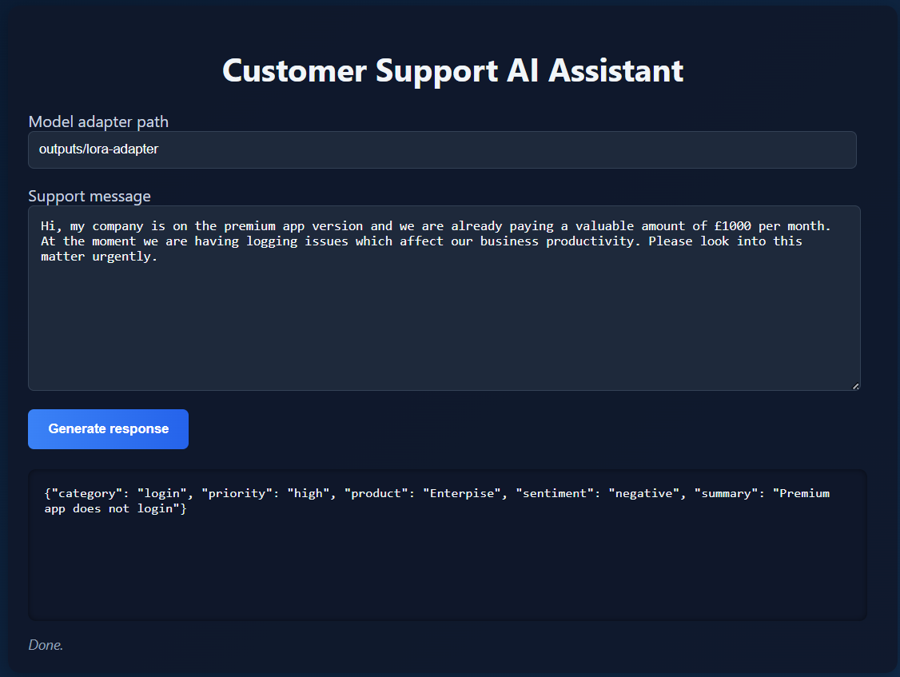

# Customer Support AI Assistant 🤝 

This project demonstrates how **fine-tuned language models (using LoRA methods)** can transform customer support feedback into **structured records**.  

Inneficiently handled customer feedback leads to:

- **Lost revenue**: frustrated customers churn quickly when problems aren’t solved.
- **Reputation damage**: negative experiences spread via media.
- **Slower productivity**: prodactivity falls when logged errors get buried in unstructured text.

In a businesses with many thousands of support messages/ customer feedback, extracting actionable insights from this data is critical. Manual processing is slow and prone to error. This system automates the process by classifying incoming messages into categories (e.g., *billing*, *login*, *bug*), assigning priorities, detecting sentiment, and summarising the issue.

By structuring support feedback into clean records, businesses can:

- Direct urgent issues immediately to the right teams.
- Monitor specific problems and errors.
- Quantify sentiment across different customer profiles.
- Feed structured data into dashboards and analytics pipelines.

---

## Project Features ✨

- **Generating synthetic and realistic data** simulating customer support scenarios.
- **LoRA methods** for fine-tuning of LLMs for domain-specific adaptation.
- **Schema-guided prompts** to guide structured outputs.
- **Evaluation pipeline** with validity checks and F1 scores.

---

## Quickstart

### ⚙️ Environment setup
```
At the root directory SupportAI:

conda create -n customer-support python=3.11 -y <br>
conda activate customer-support <br>
pip install -e . <br>

```
### 🛠️ Generate synthetic data

```
python -m assistant.synth --n_train 5000 --n_val 500 --out_dir data
```
### 🎯 Fine-tune with LoRA
```
python -m assistant.train_lora --config_path configs/train.yaml
```
### 📊 Evaluate the adapter
```
python -m assistant.eval_json --data data/synthetic_val_pairs.jsonl --adapter_path outputs/lora-adapter
```
### 💻 Run the demo
```
python app.py
```


